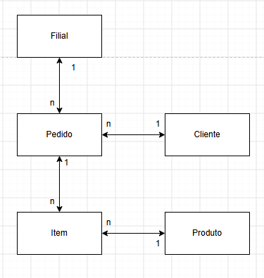

  
  <h1>🛒 Sistema de Vendas - Modelagem de Dados</h1>
  
<i>Estrutura Relacional para Controle de Filiais, Clientes, Pedidos e Produtos</i>

  
  
  

---

## 🗺️ Diagrama Entidade-Relacionamento (DER)

Abaixo está a representação visual do modelo de banco de dados, focando no controle de vendas por filial, no histórico de pedidos dos clientes e na resolução da relação entre pedidos e itens por meio de uma entidade associativa.

  
   
  <i>(Certifique-se de que o arquivo DER_vendas.png esteja na mesma pasta que este README)</i>

---

## 📦 Entidades Principais

O modelo é composto por cinco tabelas, definidas no arquivo `vendas.sql` (DBML):

<table>
  <tr>
    <td align="center" width="120"><h1>🏢</h1><b>Filial</b></td>
    <td>Cadastra as unidades de venda da empresa: <code>id_filial</code> (Chave Primária), <code>nome_filial</code>, <code>endereco</code>, <code>telefone</code> e <code>cnpj</code> (Garantido como único).</td>
  </tr>
  <tr>
    <td align="center"><h1>👤</h1><b>Cliente</b></td>
    <td>Armazena os dados cadastrais de quem compra: <code>id_cliente</code> (Chave Primária), <code>nome</code>, <code>endereco</code>, <code>cpf</code> (Garantido como único), <code>email</code> e <code>Telefone</code>.</td>
  </tr>
  <tr>
    <td align="center"><h1>🧾</h1><b>Pedido</b></td>
    <td>O núcleo operacional do sistema, identificado por <code>id_pedido</code>. Cruza o cliente e a filial e registra <code>data_pedido</code>, <code>valor_pedido</code>, <code>status_pedido</code>, <code>forma_pagamento</code> e <code>frete</code>.</td>
  </tr>
  <tr>
    <td align="center"><h1>📦</h1><b>Produto</b></td>
    <td>Mantém o catálogo de mercadorias através do <code>id_produto</code>, com <code>nome_produto</code>, <code>descricao</code>, <code>preco_unitario</code> e <code>quantidade_estoque</code>.</td>
  </tr>
  <tr>
    <td align="center"><h1>🔗</h1><b>Item_pedido</b></td>
    <td><b>Entidade Associativa</b> identificada por <code>id_item_pedido</code>. Detalha cada linha de um pedido com <code>quantidade</code>, <code>preco_unitario_item</code>, <code>subtotal</code> e <code>desconto</code>.</td>
  </tr>
</table>

---

## 🔗 Mapeamento de Relacionamentos (Foreign Keys)

A estrutura de relacionamentos (chaves estrangeiras) segue as seguintes regras de cardinalidade:

-  **Filial ↔ Pedido:** Relação de um para muitos (`1:N`). Uma filial pode registrar vários pedidos `(Filial.id_filial < Pedido.id_filial)`.
-  **Cliente ↔ Pedido:** Relação de um para muitos (`1:N`). Um cliente pode realizar vários pedidos `(Cliente.id_cliente < Pedido.id_cliente)`.
-  **Pedido ↔ Item_pedido:** Relação de um para muitos (`1:N`). Um pedido é composto por um ou mais itens `(Pedido.id_pedido < Item_pedido.id_pedido)`.
-  **Produto ↔ Pedido:** Relação de um para um (`1:1`) conforme definida no script `(Produto.id_produto - Pedido.id_pedido)`.

> Nos relacionamentos acima, o símbolo `?` do arquivo `.sql` indica participação opcional (o lado pode não ter registros associados).

---

## 📝 Observações sobre o Modelo

Pontos que valem uma revisão em uma próxima versão do diagrama:

- **Produto ↔ Pedido:** em vendas, um produto costuma aparecer em vários pedidos e um pedido tem vários produtos (`N:N`). Esse vínculo normalmente é resolvido pela tabela `Item_pedido`, adicionando nela um `id_produto`. Hoje `Item_pedido` não referencia `Produto`.
- **Tipos numéricos em documentos:** `cnpj`, `cpf` e `Telefone` estão como `int`, que não comporta o tamanho desses valores nem zeros à esquerda. `varchar` é o tipo mais indicado.
- **Valores monetários:** `valor_pedido`, `preco_unitario`, `subtotal`, `desconto` e `frete` estão como `int`. Para centavos, `decimal(10,2)` é o mais comum.

---

  <i>Desenvolvido para modelagem e documentação de estrutura de dados relacional.</i>

